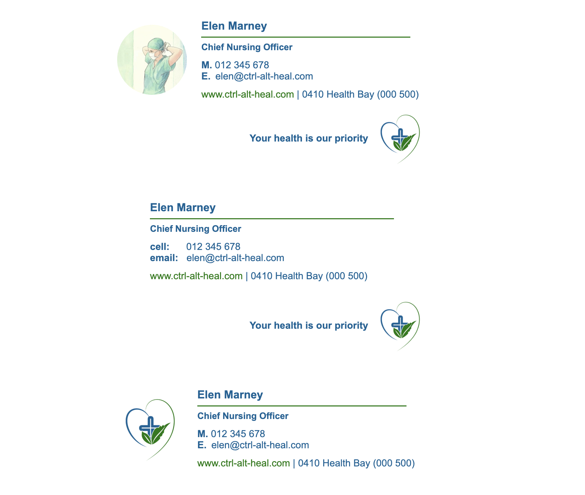

# Email Signature Design for Medical Clinic

This repository contains three distinct email signature designs created for an improvised medical clinic. The goal was to provide a clean, modern, and professional look that reflects the clinic’s brand identity and ensures consistency across all email communications.

## Table of Contents

- [Overview](#overview)
  - [Screenshots](#screenshots)
  - [Design Variants](#design-variants)
  - [Technical Details](#technical-details)
- [Author](#author)

## Overview

The project consists of three email signature styles, each crafted to suit different preferences while maintaining a cohesive brand identity. The colors and layout are inspired by a logo that conveys the clinic’s approachable yet professional vibe.

### Screenshots

### Design Variants

- Signature with Staff Photo
  Includes a professional staff photo for a personalized touch and enhanced trust.

- Simple and Clean
  Features a smaller logo accompanied by the clinic’s slogan, for a minimalist, elegant look.

- Bold and Standout
  Displays a larger, bold logo to emphasize brand presence and visibility.

Each design works well on both transparent and light blue backgrounds, ensuring versatility across various email clients and themes.

### Technical Details

- Hand-coded with semantic HTML and inline CSS for maximum compatibility with email clients.

- Responsive and visually consistent across popular email platforms.

- Designed to be easily customizable for future updates or adaptations.

## Author

Created by aqpil — passionate about clean design and user-friendly digital experiences.
